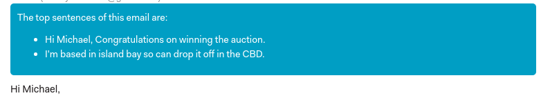

## N1 Email Summary Plugin

An [N1](https://github.com/nylas/N1) plugin that uses the [Lexrank algorithm](https://github.com/linanqiu/lexrank) to find the most important sentences in your email.

### Install

* `git clone https://github.com/NotThatSmith/N1-Email-Summary-Plugin.git`
* In N1 `Developer > Install a Plugin` and choose this directory
